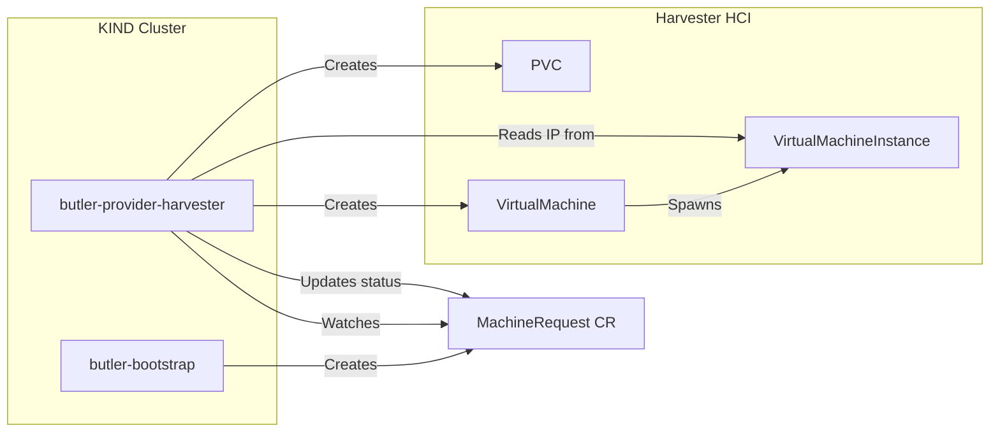

# butler-provider-harvester

Harvester HCI provider controller for Butler management cluster provisioning.

## Table of Contents

- [Overview](#overview)
- [Architecture](#architecture)
- [How It Works](#how-it-works)
- [Configuration](#configuration)
- [Development](#development)
- [Contributing](#contributing)
- [License](#license)

## Overview

butler-provider-harvester is a Kubernetes controller that provisions virtual machines on Harvester HCI in response to MachineRequest custom resources. It is used during the Butler bootstrap process to create the VMs that form the management cluster.

**You do not need to install or run this controller directly.** It is deployed automatically by the `butleradm` CLI during the bootstrap process and runs in the temporary KIND cluster alongside butler-bootstrap.

After the management cluster is provisioned, this controller is no longer needed. Ongoing VM provisioning for tenant clusters is handled by Cluster API with the Harvester infrastructure provider.

## Architecture



### Component Responsibilities

| Component | Responsibility |
|-----------|----------------|
| butler-bootstrap | Creates MachineRequest CRs for each node in the cluster |
| butler-provider-harvester | Watches MachineRequests, provisions VMs on Harvester |
| Harvester | Runs VMs via KubeVirt, provides storage and networking |

## How It Works

The controller implements a standard Kubernetes reconciliation loop:

1. **Pending**: MachineRequest is created by butler-bootstrap
2. **Creating**: Controller creates a PVC (cloned from Harvester image) and VirtualMachine
3. **Running**: VM has an IP address and is ready for Talos configuration

### Reconciliation Phases

| Phase | Description |
|-------|-------------|
| Pending | MachineRequest received, ready to create VM |
| Creating | PVC and VM created, waiting for IP address |
| Running | VM is running with an IP address assigned |
| Failed | VM creation failed (requires manual intervention) |
| Deleting | VM and PVC are being deleted |

### Harvester Resources Created

For each MachineRequest, the controller creates:

1. **PersistentVolumeClaim**: Cloned from the specified Harvester VM image
2. **VirtualMachine**: KubeVirt VM referencing the PVC as its root disk

The controller uses the Harvester image-based storage class pattern, where the PVC is annotated with `harvesterhci.io/imageId` and uses a storage class named `longhorn-<image-name>`.

## Configuration

The controller reads configuration from two sources:

### ProviderConfig

Defines Harvester connection details and defaults:

```yaml
apiVersion: butler.butlerlabs.dev/v1alpha1
kind: ProviderConfig
metadata:
  name: harvester-config
spec:
  provider: harvester
  credentialsRef:
    name: harvester-kubeconfig
    namespace: default
  harvester:
    namespace: default
    networkName: default/vlan40-workloads
    imageName: default/image-5rs6d
```

### MachineRequest

Defines the VM to create:

```yaml
apiVersion: butler.butlerlabs.dev/v1alpha1
kind: MachineRequest
metadata:
  name: butler-alpha-cp-0
spec:
  providerRef:
    name: harvester-config
  machineName: butler-alpha-cp-0
  role: control-plane
  cpu: 4
  memoryMB: 16384
  diskGB: 100
  userData: |
    #cloud-config
    ...
```

### Credentials Secret

The ProviderConfig references a Secret containing the Harvester kubeconfig:

```yaml
apiVersion: v1
kind: Secret
metadata:
  name: harvester-kubeconfig
type: Opaque
data:
  kubeconfig: <base64-encoded-kubeconfig>
```

## Development

This section is for contributors working on butler-provider-harvester itself.

### Prerequisites

- Go 1.24+
- Docker
- kubectl
- Access to a Harvester cluster for integration testing

### Building

```sh
make build
```

### Running Locally

Requires a kubeconfig with access to a cluster where MachineRequest CRDs are installed:

```sh
make run
```

### Running Tests

```sh
make test
```

### Building the Container Image

```sh
make docker-build IMG=ghcr.io/butlerdotdev/butler-provider-harvester:dev
```

### Project Structure

```
butler-provider-harvester/
├── cmd/
│   └── main.go                     # Controller entrypoint
├── internal/
│   ├── controller/
│   │   └── machinerequest_controller.go
│   └── harvester/
│       ├── client.go               # Harvester API client
│       └── types.go                # Harvester constants
├── config/
│   ├── default/                    # Kustomize base
│   ├── manager/                    # Controller deployment
│   └── rbac/                       # RBAC configuration
├── Dockerfile
├── Makefile
└── README.md
```

## Contributing

Contributions are welcome. Please read the [contributing guidelines](CONTRIBUTING.md) before submitting a pull request.

### Running Lints

```sh
make lint
```

### Running All Checks

```sh
make test
make lint
```

## License

Copyright 2026 The Butler Authors.

Licensed under the Apache License, Version 2.0 (the "License");
you may not use this file except in compliance with the License.
You may obtain a copy of the License at

    http://www.apache.org/licenses/LICENSE-2.0

Unless required by applicable law or agreed to in writing, software
distributed under the License is distributed on an "AS IS" BASIS,
WITHOUT WARRANTIES OR CONDITIONS OF ANY KIND, either express or implied.
See the License for the specific language governing permissions and
limitations under the License.
